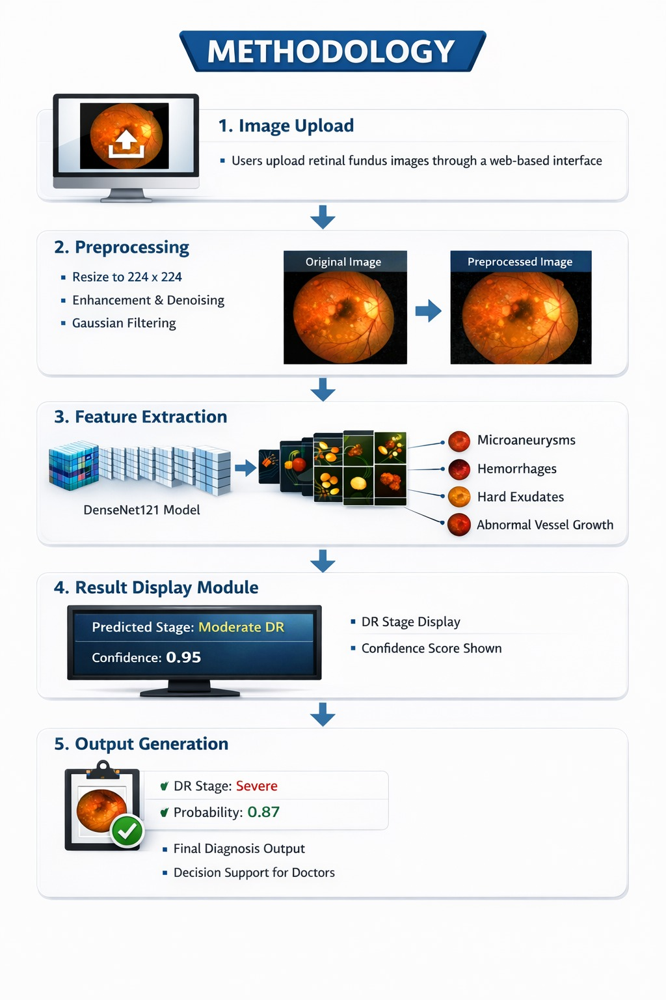
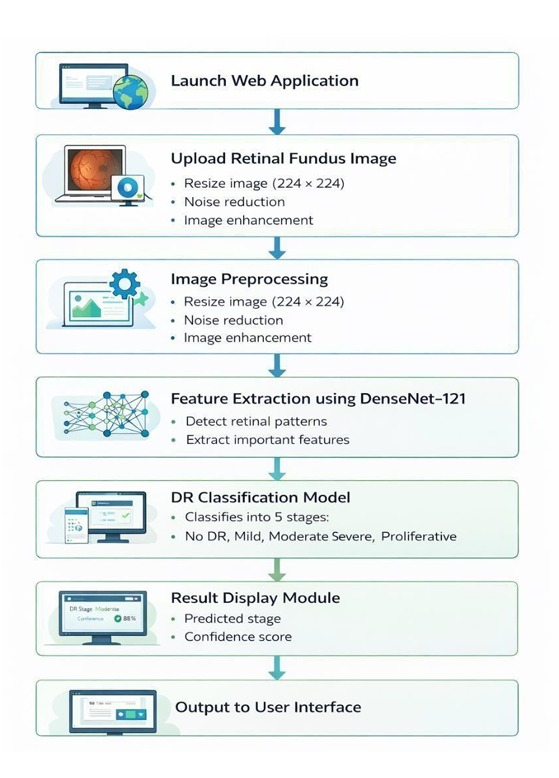
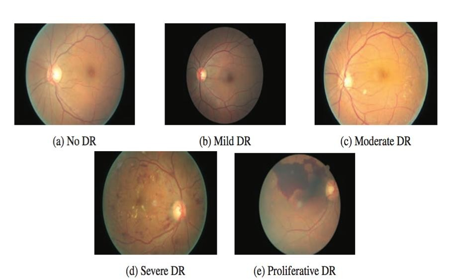
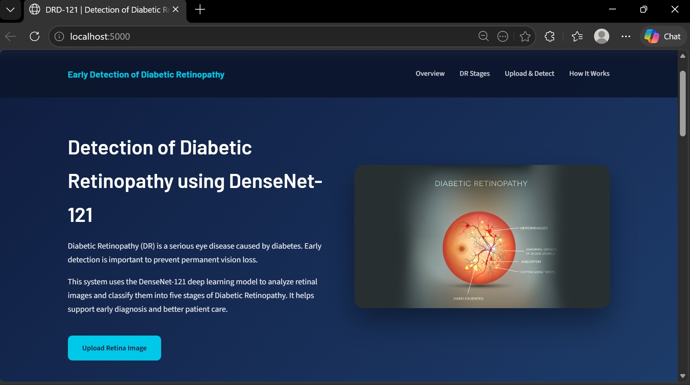
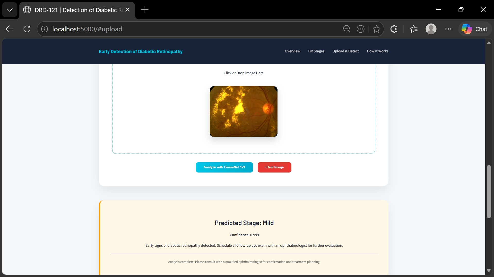
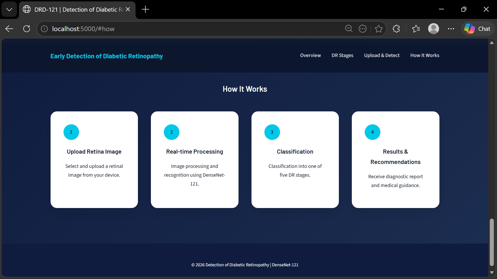

# 🩺 DRD-121: Diabetic Retinopathy Detection Using DenseNet121

## 📌 Overview  

This project is a Deep Learning-based web application that detects the severity of Diabetic Retinopathy (DR) from retinal fundus images.
It uses a DenseNet121 Convolutional Neural Network (CNN) to classify images into different stages of DR and provides predictions through a simple web interface built with Flask.

It helps in:  
✔ Early disease detection  
✔ Faster medical screening  
✔ Supporting healthcare professionals

## 🔄 Methodology

<p align="center">
  
</p>

---

## ⚙️ System Workflow

<p align="center">
  
</p>

---

## 🏥 DR Severity Stages

<p align="center">
  
</p>

---

## 🖥️ UI Preview

<p align="center">
  
  
  <br><br>
  
  
</p>

---

## 🎯 Features  
- Upload retinal image  
- Predict DR severity level  
- Simple web interface  
- Fast and accurate results  


## 🧠 Model Details  

- Model: **DenseNet121 (Transfer Learning)**  
- Input Size: **224 × 224**  
- Output: **5 Classes Classification**  

### 🏥 DR Severity Levels:

| Class | Description |
|------|------------|
| 0 | No DR |
| 1 | Mild |
| 2 | Moderate |
| 3 | Severe |
| 4 | Proliferative DR |


## ⚙️ Tech Stack  

| Category | Technology |
|---------|-----------|
| Backend | Flask |
| ML/DL | TensorFlow, Keras |
| Image Processing | OpenCV, PIL |
| Frontend | HTML, CSS |
| Deployment | Local / Cloud |


## 📂 Project Structure  

```
    Diabetic_Retinopathy_Detection/
    │
    ├── models/
    │   └── model.py                          # Model building & preprocessing
    │
    ├── static/
    │   ├── Images/                           # UI images
    │   ├── main.css                          # Styling
    │   └── main.js                           # Frontend logic
    │
    ├── templates/
    │   ├── base.html                         # Base layout
    │   └── index.html                        # Main UI page
    │
    ├── app.py                                # Flask backend
    ├── utils.py                              # Image conversion utilities
    └── requirements.txt                      # Dependencies
```

## ⚠️ Important Note

Due to GitHub size limits, **model files (.h5)** are not included.

👉 Download model files from: *(https://drive.google.com/drive/folders/13JP1M8i-tHUwhnJvgtgdE7mLgf-gFbhw?usp=drive_link)*

👉 Place inside:

```
models/pretrained/
```

## 🔄 Workflow  

```
User Upload Image → Preprocessing → Model Prediction → Result Display
```


## 🚀 How to Run the Project

### 1️⃣ Clone the Repository

```bash
git clone https://github.com/PujithaKakumanu/Diabetic-Retinopathy-Detection-using-DenseNet121.git
cd Diabetic_Retinopathy_Detection
```

---

### 2️⃣ Create Virtual Environment

```bash
python -m venv venv
```

#### ▶ Activate Environment

**For Windows:**

```bash
venv\Scripts\activate
```

**For Mac/Linux:**

```bash
source venv/bin/activate
```

---

### 3️⃣ Install Dependencies

```bash
pip install -r requirements.txt
```

---

### 4️⃣ Run the Application

```bash
python app.py
```

---

### 5️⃣ Open in Browser

```bash
http://localhost:5000
```

## 📸 Input Requirements  

- Image Type: JPG / PNG  
- Retinal Fundus Image  

## 📊 Sample Output  

```
Result: Moderate DR  
Confidence: 0.87
```

## 🌟 Future Enhancements  

  🔹 Mobile App Integration  
  🔹 Cloud Deployment (AWS / Azure)  
  🔹 Real-time camera scanning   
  🔹 Explainable AI (Heatmaps)  


## 🏆 Achievements  

✔ Real-world healthcare problem solving  
✔ Deep learning implementation  
✔ Full-stack integration  


## 👩‍💻 Author  

**Pujitha Kakumanu**  


## ⭐ Support

If you like this project, please ⭐ star the repository!
